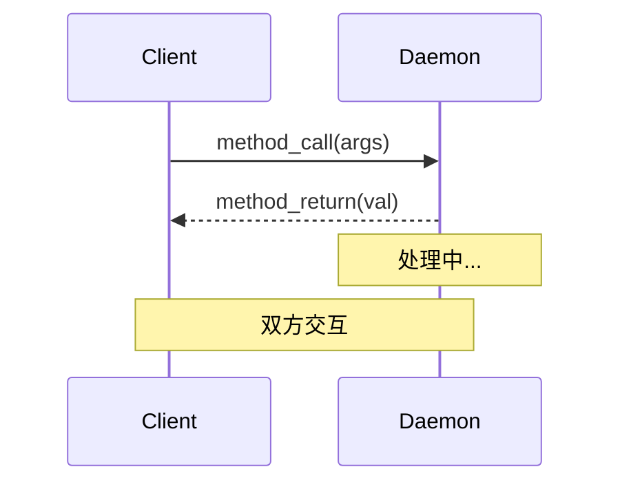
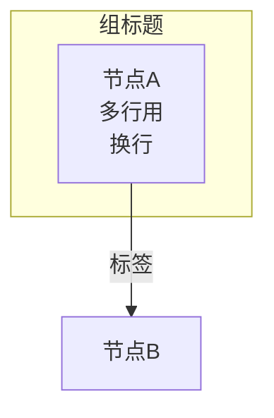

# 技术文档编写 Skill

> 基于 D-Bus 文档编写与多轮迭代的经验总结，涵盖结构设计、可视化选择、CSS/Mermaid 图表、迭代流程。

---

## 1. 文档结构法则

### 1.1 金字塔型分层

```
H1  文档标题（一个文档只有一个）
├── H2  大章节（概述/架构/模式/概念/类型/总结）
│   ├── H3  子主题（每个 H2 下 2~6 个 H3）
│   │   ├── 段落 + 图表
│   │   ├── 代码示例
│   │   └── 表格（参考数据）
│   └── H3  ...
└── H2  ...
```

**原则：**
- H2 之间用 `<!-- ==== -->` 分隔注释，确保编辑器导航清晰
- 每个 H2 先给一句话概括，再展开细节（**倒金字塔**写作）
- 序号使用 `1.` `2.` 而非 `一、` 提升扫描效率

### 1.2 推荐章节骨架

适用于大多数技术主题文档：

```
1. 概述          — 是什么、解决什么问题、核心能力列表
2. 架构设计       — 整体架构图 + 核心组件表 + 层次化示例
3. 分类/变体      — 不同类型的对比表 + 选择建议
4. 核心模式       — 每个模式：概念 → 流程图 → 代码示例 → 参数表
5. 关键概念/规范   — 命名约定表 + 标准接口表 + 配置项表
6. 数据类型/协议   — 基本类型网格 + 容器类型表 + 签名示例
7. 进阶机制       — 概念 → 流程图 → 配置说明
8. 协议分层/对比   — 分层图 + 实现选择建议
9. 总结           — 核心优势列表 + 生态链接
```

---

## 2. 可视化选择决策树

```
需要展示什么？
├── 系统架构 / 组件关系
│   ├── HTML: CSS Flex/Grid 盒子图（.arch-diagram）
│   ├── Markdown: Mermaid graph TB / flowchart
│   └── 原则: 组件=卡片, 连接=边框/箭头, 两层嵌套=subgraph
│
├── 对象/层次树
│   ├── HTML: Flex 行 + 固定 padding-left 缩进 + 彩色标签
│   ├── Markdown: 纯文本缩进树（等宽字体）
│   └── 原则: 每层独立 row, 连接符用 ├──/└──, 分类用颜色
│
├── 消息/调用时序
│   ├── HTML: 步骤列表（.seq-step）: 编号 + 源→目标 + 消息
│   ├── Markdown: Mermaid sequenceDiagram
│   └── 原则: 显式标注方向(→/←), 虚线分隔逻辑阶段, note 放旁注
│
├── 协议/分层堆栈
│   ├── HTML: CSS 堆叠卡片（.layer-diagram）渐变色区分
│   ├── Markdown: Mermaid graph TB 纵向链表
│   └── 原则: 底层用暖色, 高层用冷色, 每层标题+描述
│
└── 数据/对比
    └── 直接用表格（Markdown/HTML table）
```

**核心教训：不要用 ASCII art 做架构图** — 对齐脆弱、不可维护、不专业。

---

## 3. HTML 文档编写模版

### 3.1 性能与可移植性

```css
/* 必选：深色主题变量 */
:root {
  --bg: #1a1a2e;        --surface: #16213e;
  --text: #e0e0e0;      --accent: #e94560;
  --code-bg: #2d2d44;   --border: #2a2a4a;
  --method: #4fc3f7;     --signal: #ffb74d;
  --property: #81c784;   --error: #e57373;
}
```

- **零外部依赖** — 不引入 Bootstrap / Tailwind / Mermaid.js CDN
- **颜色语义化** — 方法=蓝、信号=橙、属性=绿、错误=红、Daemon=品红
- **响应式** — `@media (max-width: 600px)` 降级移动端
- **monospace 栈**: `'Fira Code', 'JetBrains Mono', 'Consolas', monospace`

### 3.2 图表 CSS 组件库

**架构图 (`arch-diagram`)**

```css
.arch-diagram { /* 容器 */ }
.arch-diagram .daemon-box { /* 主节点: 边框2px solid 强调色, 圆角8px */ }
.arch-diagram .daemon-box .router-box { /* 嵌套子节点: 虚线边框, 深背景 */ }
.arch-diagram .app-card { /* 子节点卡片: ::before 绘制连线 */ }
.arch-diagram .app-card::before { /* 竖线连接器: width:2px, top:-16px */ }
```

关键技巧：
- 子节点用 `::before` 伪元素做竖线连接器，避免额外 DOM
- Flex 布局 + `gap` 替代 margin 控制间距
- `flex-wrap: wrap` 确保窄屏不溢出

**时序图 (`seq-diagram`)**

```css
.seq-step {
  display: flex;        /* 单行排列: 编号 | 源 | 箭头 | 目标 | 消息 | 旁注 */
  align-items: baseline; /* 基线对齐, 文本不同大小也能对齐 */
  gap: 8px;             /* 统一间距 */
}
.arr-r { color: var(--method); }    /* 右箭头 = 方法调用方向 */
.arr-l { color: var(--property); }  /* 左箭头 = 返回值方向 */
```

关键技巧：
- 用 `flex` + `gap` 而非 `text-align: center` — 居中对齐看不清流向
- 颜色编码方向（→蓝 / ←绿），一眼区分请求/响应
- 用 `<hr class="seq-sep">` 分隔逻辑阶段
- 旁注用 `<span class="step-note">` 斜体灰色，不干扰主流程阅读

**分层图 (`layer-diagram`)**

```css
.layer-diagram .layer { /* 无圆角, border-bottom 分隔 */ }
.layer-l4 { background: #1a1a3e; }  /* 最高层=冷色 */
.layer-l1 { background: #2e1a1a; }  /* 最底层=暖色 */
```

关键技巧：
- `background` 渐变区分层级，不依赖边框
- `.layer:last-child { border-bottom: none }` 避免底部多余线

**树形图 (`tree-diagram`)**

关键教训：**不要用等宽空格对齐**。改用：

```css
.tn-row { display: flex; }
.tn-l1 { padding-left: 20px; }  /* 缩进=左内边距, 不是空格 */
.tn-l2 { padding-left: 40px; }
.tn-l3 { padding-left: 60px; }
.tn-conn { min-width: 20px; text-align: right; } /* 连接符右对齐 */
```

每行 = 一个 flex row，连接符 + 节点 + 标签各自独立，字体变化不影响对齐。

### 3.3 代码块与表格

```css
pre {
  background: var(--code-bg);
  padding: 16px 20px;     /* 上下紧凑, 左右宽松 */
  border-radius: 6px;
  border: 1px solid var(--border);
}
table { width: 100%; border-collapse: collapse; }
th { background: var(--surface2); color: #fff; }
td { background: var(--surface); }
```

---

## 4. Markdown 文档编写模版

### 4.1 Mermaid 图表选择

| 图表需求 | Mermaid 类型 | 示例 |
|----------|-------------|------|
| 组件连接关系 | `graph TB` 或 `graph LR` | `A --> B --> C` |
| 嵌套组件 | `subgraph` | `subgraph Daemon ... end` |
| 消息时序 | `sequenceDiagram` | `A->>B: msg` / `B-->>A: reply` |
| 状态机 | `stateDiagram-v2` | |
| 类关系 | `classDiagram` | |

### 4.2 Mermaid 时序图规范



- `participant` 用短别名，`as` 后写显示名
- `->>`  实线箭头用于请求（同步语义）
- `-->>` 虚线箭头用于回复/异步
- `Note over X` 用于单方注释，`Note over X,Y` 用于交互注释

### 4.3 Mermaid 流程图规范



- `<br/>` 换行，`<br/>` 前留空格效果好
- 方括号 `["text"]` 生成圆角矩形
- 花括号 `{"text"}` 生成菱形（判断节点）
- `subgraph` 用于嵌套组件

### 4.4 能不用 Mermaid 就不用

**适合用 Mermaid：**
- 时序图（sequenceDiagram 表达力强）
- 简单的组件连接图（graph）

**不适合用 Mermaid：**
- 对象/文件层次树 → 用代码块 + 缩进文本更清晰
- 复杂的嵌套架构图 → Mermaid subgraph 排版不可控
- 需要精确颜色控制的图表 → 用 HTML/CSS

---

## 5. 迭代优化流程

### 5.1 三遍工作法

```
第一遍: 写完所有内容（不追求完美）
  → 目录结构 + 文字 + ASCII 草图

第二遍: 替换所有 ASCII 为专业图表
  → CSS 盒子图 / Mermaid / 表格

第三遍: 优化对齐和视觉
  → 检查颜色一致性、间距、移动端效果
  → 处理用户反馈点对点修正
```

### 5.2 常见反馈与修正

| 反馈 | 问题 | 修正 |
|------|------|------|
| "居中对齐看不清" | 时序图 `text-align:center` + 箭头字符 | 改为 flex 步骤列表, 源→目标显式标注 |
| "对齐很乱" | 树形图用等宽空格对齐 | 改为 CSS padding-left 缩进 |
| "ASCII 图不专业" | `<pre>` 里的 ├──└── 连线 | 改为 CSS Flex/Grid 盒子图 |
| "能不能用 Mermaid" | HTML 图不可移植到 Markdown | 输出 Markdown 版, 用 Mermaid 替代 CSS 图 |
| "颜色区分度不够" | 单一色调 | 建立语义色板: 方法=蓝/信号=橙/属性=绿/错误=红 |

### 5.3 双格式策略

同一份文档，两种输出：

| 格式 | 图表方案 | 适用场景 |
|------|---------|---------|
| **HTML** | CSS 组件库（arch-diagram / seq-diagram / layer-diagram / tree-diagram） | 独立浏览器阅读, 完全控制样式 |
| **Markdown** | Mermaid（sequenceDiagram / graph） + 原生表格 | GitHub/GitLab/VS Code 渲染 |

写 HTML 版时，CSS 类名和变量提前规划好；写 Markdown 版时，用 Mermaid 替代所有图表，内容保持一致。

---

## 6. 快速检查清单

编写完成后逐项检查：

- [ ] H2 之间有 `<!-- ==== -->` 分隔注释
- [ ] 所有图表从 ASCII 替换为 CSS 盒子图 或 Mermaid
- [ ] 时序图使用显式源→目标标注，不依赖居中对齐
- [ ] 树形结构使用 CSS padding 缩进，不用空格
- [ ] 颜色语义一致：蓝=方法调用, 绿=属性/返回, 橙=信号, 红=错误
- [ ] 代码块有语言标记（` ```c ` 而非 ` ``` `）
- [ ] 表格有表头，`th` 背景色区别于 `td`
- [ ] 零外部依赖（不引用 CDN）
- [ ] 导航栏 sticky 定位（HTML 版）
- [ ] `@media (max-width: 600px)` 移动端降级
- [ ] Markdown 版与 HTML 版内容一致
