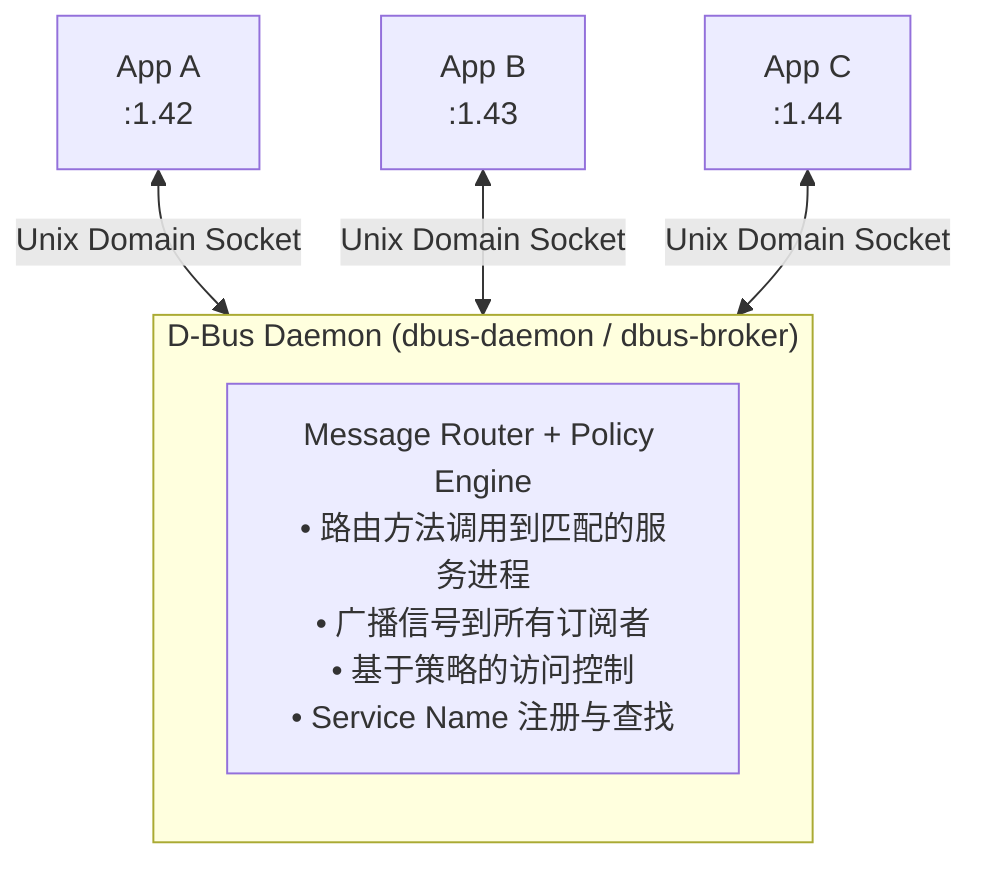
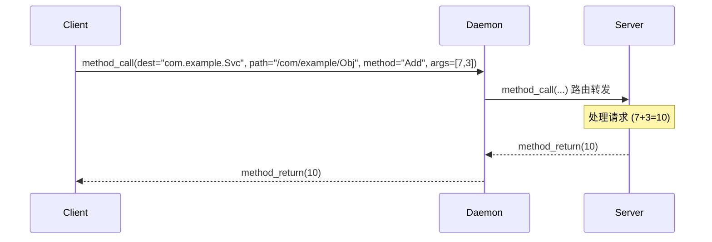
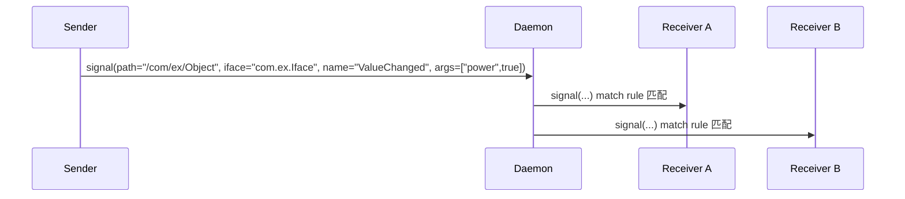
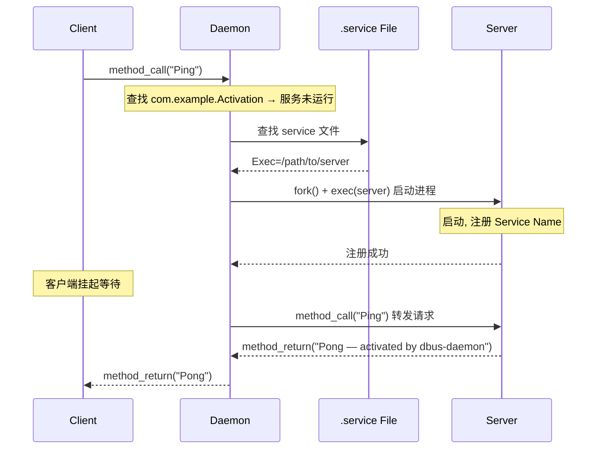
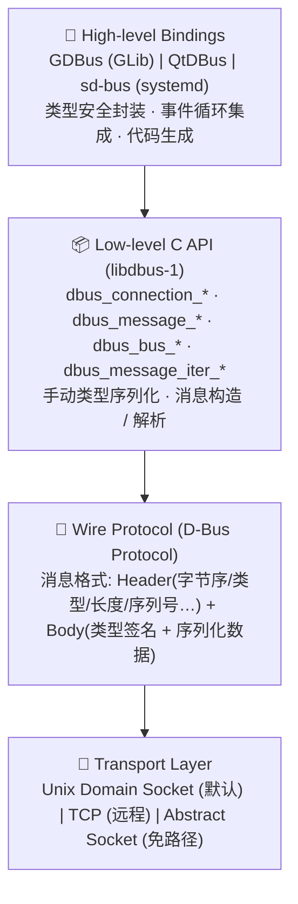

# D-Bus 详解 — Linux 桌面 IPC 总线

> 基于 libdbus-1 参考实现 | [D-Bus Specification](https://dbus.freedesktop.org/doc/dbus-specification.html)

---

## 1. 什么是 D-Bus

**D-Bus**（Desktop Bus）是由 freedesktop.org 制定的 **进程间通信（IPC）** 协议，最初设计用于 Linux 桌面环境，现已广泛应用于嵌入式系统、系统服务等领域。它提供了一套完整的消息传递机制，使得独立进程之间可以安全、高效地交换数据。

**核心能力：**

- 方法调用（RPC）— 远程过程调用模型
- 信号广播（Signal）— 发布/订阅模型
- 属性访问（Properties）— 标准化的属性读写接口
- 服务激活（Activation）— 按需自动启动服务进程
- 类型安全 — 强类型的消息序列化系统
- 安全控制 — 基于策略的访问控制

---

## 2. 架构设计



### 2.1 核心组件

| 组件 | 说明 |
|------|------|
| **D-Bus Daemon** | 消息总线守护进程（`dbus-daemon`），负责消息路由、服务名管理、访问控制。每个 Bus 实例有且仅有一个 daemon 进程。 |
| **Client Connection** | 每个使用 D-Bus 的进程通过 Unix Domain Socket 连接到 daemon，获得唯一的连接名（如 `:1.42`）。 |
| **Service Name** | 人类可读的全局标识（如 `org.freedesktop.NetworkManager`），进程可请求一个或多个服务名，daemon 负责去重和路由。 |
| **Object Path** | 类似文件路径的层次化结构（如 `/org/freedesktop/NetworkManager/Devices/0`），标识服务内某个具体的 D-Bus 对象。 |
| **Interface** | 一组方法、信号、属性的集合，类似 OOP 中的接口概念（如 `org.freedesktop.NetworkManager.Device`）。 |

### 2.2 层次化设计

以 NetworkManager 为例展示 D-Bus 的对象/接口/方法层次：

```
NetworkManager                                    ← Service Name
└── /org/freedesktop/NetworkManager               ← Object Path
    ├── org.freedesktop.NetworkManager            ← Interface
    │   ├── GetDevices()          [Method]
    │   ├── ActivateConnection()  [Method]
    │   ├── StateChanged          [Signal]
    │   └── WirelessEnabled       [Property]
    │
    └── org.freedesktop.DBus.Properties           ← 标准接口
        ├── Get(iface, prop)
        ├── Set(iface, prop, val)
        └── GetAll(iface)
```

---

## 3. 总线类型

| 总线类型 | Socket 地址 | 用途 |
|----------|------------|------|
| **System Bus** | `unix:path=/var/run/dbus/system_bus_socket` | 系统级服务：硬件事件、网络管理、电源管理、udev、systemd-logind。需要 root 权限或 PolicyKit 授权。 |
| **Session Bus** | `unix:path=/run/user/1000/bus` 或 `$DBUS_SESSION_BUS_ADDRESS` | 用户会话级服务：桌面通知、剪贴板、文件管理器、媒体播放器。每个登录用户一个实例。 |
| **Private Bus** | 自定义地址 | 应用内部或应用间私有通信，不与其他进程共享。systemd 使用 private bus 进行内部通信。 |

> **选择建议：** 系统守护进程 → System Bus / 桌面应用通信 → Session Bus / 进程内/小范围通信 → Private Bus

---

## 4. 通信模式

D-Bus 支持 **四种消息类型**，对应三种核心通信模式：

### 4.1 方法调用 (METHOD_CALL + METHOD_RETURN) — RPC

D-Bus 最基础的通信模式，客户端向服务端发送请求并等待回复，是典型的**同步/异步 RPC** 模型。



**API 示例 (libdbus-1)：**

```c
// === 客户端 ===
DBusMessage *msg = dbus_message_new_method_call(
    "com.example.Svc",          // 目标服务名
    "/com/example/Obj",         // 对象路径
    "com.example.Iface",        // 接口
    "Add");                     // 方法名
dbus_int32_t a = 7, b = 3;
dbus_message_append_args(msg,
    DBUS_TYPE_INT32, &a,
    DBUS_TYPE_INT32, &b,
    DBUS_TYPE_INVALID);

// 同步调用，阻塞等待回复
DBusMessage *reply = dbus_connection_send_with_reply_and_block(
    conn, msg, DBUS_TIMEOUT_USE_DEFAULT, &err);

// 解析回复
dbus_int32_t result;
dbus_message_get_args(reply, &err,
    DBUS_TYPE_INT32, &result, DBUS_TYPE_INVALID);
```

### 4.2 信号广播 (SIGNAL) — 发布/订阅

信号是一种**单向广播**机制：发送者发布信号，daemon 将信号推送给所有匹配 match rule 的订阅者。信号不需要回复，发送者不知道有哪些接收者。



**订阅规则 (Match Rule)：**

客户端通过 **match rule** 字符串告诉 daemon 对哪些信号感兴趣，只有匹配的信号才会被转发。这种服务端过滤机制避免了不必要的消息传输。

```c
// 订阅 match rule
dbus_bus_add_match(conn,
    "type='signal',"
    "interface='com.example.Iface',"
    "member='ValueChanged'",
    &err);

// 在消息循环中接收信号
while ((msg = dbus_connection_pop_message(conn)) != NULL) {
    if (dbus_message_is_signal(msg, "com.example.Iface", "ValueChanged")) {
        // 处理信号
    }
    dbus_message_unref(msg);
}
```

**Match Rule 参数：**

| 参数 | 说明 | 示例 |
|------|------|------|
| `type` | 消息类型 | `type='signal'` |
| `sender` | 发送者连接名 | `sender=':1.42'` |
| `interface` | 接口名 | `interface='org.foo.Bar'` |
| `member` | 信号名 | `member='PropertiesChanged'` |
| `path` | 对象路径 | `path='/org/freedesktop/UPower'` |
| `path_namespace` | 路径前缀匹配 | `path_namespace='/org/freedesktop'` |
| `destination` | 目标连接名 | `destination='com.example.App'` |

### 4.3 属性接口 (Properties)

D-Bus 规范定义了标准接口 `org.freedesktop.DBus.Properties`，所有 D-Bus 对象都应该实现这个接口以支持属性读写。

| 方法 | 参数 | 返回值 | 说明 |
|------|------|--------|------|
| `Get` | STRING interface, STRING property | VARIANT value | 读取单个属性 |
| `Set` | STRING interface, STRING property, VARIANT value | — | 写入单个属性 |
| `GetAll` | STRING interface | DICT\<STRING,VARIANT\> | 读取接口全部属性 |

当属性值发生变化时，应发送标准信号 `PropertiesChanged`：

```
PropertiesChanged 信号参数:
  STRING  interface_name         — 属性所属的接口
  DICT    changed_properties     — 变更的属性键值对
  ARRAY   invalidated_properties — 失效的属性名列表（值未知）
```

### 4.4 错误回复 (ERROR)

当方法调用失败时，服务端返回 **ERROR** 消息而非 **METHOD_RETURN**。D-Bus 预定义了一组标准错误名称。

| 错误名 | 说明 |
|--------|------|
| `org.freedesktop.DBus.Error.Failed` | 通用错误 |
| `org.freedesktop.DBus.Error.InvalidArgs` | 参数无效 |
| `org.freedesktop.DBus.Error.UnknownMethod` | 方法不存在 |
| `org.freedesktop.DBus.Error.UnknownInterface` | 接口不存在 |
| `org.freedesktop.DBus.Error.UnknownProperty` | 属性不存在 |
| `org.freedesktop.DBus.Error.AccessDenied` | 权限不足 |
| `org.freedesktop.DBus.Error.ServiceUnknown` | 服务名未注册 |
| `org.freedesktop.DBus.Error.Timeout` | 超时无回复 |

---

## 5. 核心概念

### 5.1 命名约定

| 概念 | 格式 | 示例 |
|------|------|------|
| **Service Name** | 反向域名，至少包含一个 `.` | `org.freedesktop.NetworkManager` |
| **Object Path** | 类似 Unix 路径，以 `/` 分隔 | `/org/freedesktop/NetworkManager/Devices/0` |
| **Interface** | 同 Service Name 格式 | `org.freedesktop.NetworkManager.Device` |
| **Member** | 字母数字和下划线组成，必须以字母开头 | `GetDevices`, `StateChanged` |
| **Connection Name** | `:数字.数字` | `:1.42`（daemon 自动分配） |
| **Error Name** | 同 Interface 格式 | `org.freedesktop.DBus.Error.InvalidArgs` |

### 5.2 标准接口

| 接口 | 说明 |
|------|------|
| `org.freedesktop.DBus.Introspectable` | 提供 `Introspect()` 方法，返回描述对象接口的 XML |
| `org.freedesktop.DBus.Properties` | `Get` / `Set` / `GetAll` 属性操作 + `PropertiesChanged` 信号 |
| `org.freedesktop.DBus.ObjectManager` | `GetManagedObjects()` — 获取对象树中所有对象的接口和属性 |
| `org.freedesktop.DBus.Peer` | `Ping()` 和 `GetMachineId()` |

### 5.3 Name 所有权

进程请求 Service Name 时的 Flag 选项：

| Flag | 行为 |
|------|------|
| `DBUS_NAME_FLAG_REPLACE_EXISTING` | 如果该名称已被占用，替换原所有者（若原所有者允许） |
| `DBUS_NAME_FLAG_ALLOW_REPLACEMENT` | 允许其他进程替换本进程 |
| `DBUS_NAME_FLAG_DO_NOT_QUEUE` | 如果名称已被占用且不可替换，直接失败而不排队 |

请求后的返回码：

| 返回值 | 含义 |
|--------|------|
| `DBUS_REQUEST_NAME_REPLY_PRIMARY_OWNER` (1) | 成功成为主所有者 |
| `DBUS_REQUEST_NAME_REPLY_IN_QUEUE` (2) | 已加入等待队列 |
| `DBUS_REQUEST_NAME_REPLY_EXISTS` (3) | 名称已被占用且不可替换 |
| `DBUS_REQUEST_NAME_REPLY_ALREADY_OWNER` (4) | 已经是该名称的所有者 |

---

## 6. 类型系统

D-Bus 具有**强类型**的消息序列化系统，所有参数必须声明类型。类型使用 **type signature string** 表示（例如 `"si"` 表示 string + int32）。

### 6.1 基本类型

| 类型 | 签名 | 说明 |
|------|------|------|
| `BYTE` | `y` | 8 位无符号整数 |
| `BOOLEAN` | `b` | 布尔值 |
| `INT16` | `n` | 16 位有符号整数 |
| `UINT16` | `q` | 16 位无符号整数 |
| `INT32` | `i` | 32 位有符号整数 |
| `UINT32` | `u` | 32 位无符号整数 |
| `INT64` | `x` | 64 位有符号整数 |
| `UINT64` | `t` | 64 位无符号整数 |
| `DOUBLE` | `d` | IEEE 754 双精度浮点 |
| `STRING` | `s` | UTF-8 字符串 |
| `OBJECT_PATH` | `o` | 对象路径 |
| `SIGNATURE` | `g` | 类型签名 |
| `UNIX_FD` | `h` | Unix 文件描述符 |

### 6.2 容器类型

| 类型 | 签名 | 示例签名 | 说明 |
|------|------|----------|------|
| **STRUCT** | `(...)` | `(si)` | 固定字段的结构体，类似 C 的 struct |
| **ARRAY** | `a{type}` | `ai` (int32 数组), `as` (string 数组) | 同类型元素的序列 |
| **VARIANT** | `v` | `v` | 可容纳任意单一类型的容器，运行时携带类型信息 |
| **DICT_ENTRY** | `{kv}` | `{si}` | 键值对，仅出现在 ARRAY 中（即 `a{sv}`） |

### 6.3 类型签名示例

```
"i"               → 单个 int32
"si"              → struct { string, int32 }
"a{sv}"           → 字典 (string → variant)
"a(si)"           → struct 数组
"(siab)"          → struct { string, int32, array<byte>, boolean }
"a{sa{sv}}"       → 嵌套字典 (string → dict{string, variant})
```

---

## 7. 服务激活 (Service Activation)

D-Bus daemon 支持**按需启动**服务 — 当客户端向一个未运行的服务发送消息时，daemon 自动根据 `.service` 文件中的指令启动该服务。



### 7.1 .service 文件

Service 文件定义了 daemon 如何启动服务进程：

```ini
[D-BUS Service]
Name=com.example.ActivationTest
Exec=/usr/local/bin/dbus_activation_server
User=root
SystemdService=dbus-com.example.service
```

| 字段 | 说明 |
|------|------|
| `Name` | 服务名，必须与进程请求的 service name 一致 |
| `Exec` | 启动服务的可执行文件路径（绝对路径） |
| `User` | 以哪个用户身份运行（仅 system bus） |
| `SystemdService` | systemd 服务单元名（推荐用于 system bus） |

### 7.2 Service 文件位置

| 范围 | 路径 |
|------|------|
| 用户层面 (session bus) | `~/.local/share/dbus-1/services/` |
| 系统层面 (system bus) | `/usr/share/dbus-1/services/` |
| 系统层面 (system bus) | `/usr/local/share/dbus-1/services/` |

---

## 8. 协议分层

D-Bus 协议采用分层设计：



**实现选择：**

- `libdbus-1` — freedesktop.org 参考实现，最底层，功能最完整
- `GDBus` — GLib/GIO 绑定，GObject 集成，异步 API
- `sd-bus` — systemd 提供的现代 C 库，更简洁的 API
- `QtDBus` — Qt 框架绑定，与 Qt 类型系统和事件循环集成

---

## 9. libdbus-1 API 接口速查

> 以下 API 均来自 freedesktop.org 的 libdbus-1 参考实现。完整文档见 [D-Bus API Reference](https://dbus.freedesktop.org/doc/api/html/)。

### 9.1 连接管理

| API | 签名 | 说明 |
|-----|------|------|
| `dbus_error_init` | `void dbus_error_init(DBusError *error)` | 初始化 error 对象，使用前必须调用 |
| `dbus_error_is_set` | `dbus_bool_t dbus_error_is_set(const DBusError *error)` | 检查 error 是否被设置（非空） |
| `dbus_error_free` | `void dbus_error_free(DBusError *error)` | 释放 error 内部资源 |
| `dbus_bus_get` | `DBusConnection* dbus_bus_get(DBusBusType type, DBusError *error)` | 连接到指定总线。`type`: `DBUS_BUS_SESSION` / `DBUS_BUS_SYSTEM`。返回的连接已被 daemon 认证，且自动集成主循环 |
| `dbus_connection_unref` | `void dbus_connection_unref(DBusConnection *conn)` | 减少连接引用计数，归零时关闭连接 |
| `dbus_connection_flush` | `void dbus_connection_flush(DBusConnection *conn)` | 阻塞直到所有待发送数据写入 socket |

**使用位置**: `dbus_server.cpp`, `dbus_client.cpp`, `dbus_signal_sender.cpp`, `dbus_signal_receiver.cpp`

---

### 9.2 消息构造（发送方）

| API | 签名 | 说明 |
|-----|------|------|
| `dbus_message_new_method_call` | `DBusMessage* dbus_message_new_method_call(const char *dest, const char *path, const char *iface, const char *method)` | 创建 METHOD_CALL 消息。四个参数定位目标：服务名、对象路径、接口名、方法名 |
| `dbus_message_new_signal` | `DBusMessage* dbus_message_new_signal(const char *path, const char *iface, const char *name)` | 创建 SIGNAL 消息。无 `dest` 参数（广播语义），只需 path + iface + name |
| `dbus_message_new_method_return` | `DBusMessage* dbus_message_new_method_return(DBusMessage *method_call)` | 以收到的 method_call 消息为模板，创建 METHOD_RETURN 回复 |
| `dbus_message_new_error` | `DBusMessage* dbus_message_new_error(DBusMessage *method_call, const char *error_name, const char *error_message)` | 创建 ERROR 回复消息 |
| `dbus_message_append_args` | `dbus_bool_t dbus_message_append_args(DBusMessage *msg, int first_type, ...)` | 向消息追加基本类型参数。变参以 `DBUS_TYPE_*` 类型标记+值指针成对传入，`DBUS_TYPE_INVALID` 终止。**注意：不支持 VARIANT/ARRAY/DICT 等容器类型** |
| `dbus_message_unref` | `void dbus_message_unref(DBusMessage *msg)` | 减少消息引用计数，归零时释放消息内存 |

**使用位置**: `dbus_client.cpp:26-37`, `dbus_server.cpp:37-43`, `dbus_signal_sender.cpp:38-50`

---

### 9.3 消息解析（接收方）

| API | 签名 | 说明 |
|-----|------|------|
| `dbus_message_get_type` | `int dbus_message_get_type(DBusMessage *msg)` | 返回消息类型：`DBUS_MESSAGE_TYPE_METHOD_CALL` / `METHOD_RETURN` / `ERROR` / `SIGNAL` |
| `dbus_message_is_method_call` | `dbus_bool_t dbus_message_is_method_call(DBusMessage *msg, const char *iface, const char *method)` | 检查是否为指定接口+方法的调用。**method 参数不能为 NULL**（否则触发断言崩溃） |
| `dbus_message_is_signal` | `dbus_bool_t dbus_message_is_signal(DBusMessage *msg, const char *iface, const char *name)` | 检查是否为指定接口+名称的信号 |
| `dbus_message_get_args` | `dbus_bool_t dbus_message_get_args(DBusMessage *msg, DBusError *error, int first_type, ...)` | 从消息中按顺序提取基本类型参数。变参格式与 `append_args` 相同。**不支持容器类型** |
| `dbus_message_get_member` | `const char* dbus_message_get_member(DBusMessage *msg)` | 返回方法名/信号名（member 字段） |
| `dbus_message_get_interface` | `const char* dbus_message_get_interface(DBusMessage *msg)` | 返回消息的接口名 |
| `dbus_message_get_sender` | `const char* dbus_message_get_sender(DBusMessage *msg)` | 返回消息发送者的唯一连接名（如 `:1.42`） |
| `dbus_message_get_path` | `const char* dbus_message_get_path(DBusMessage *msg)` | 返回消息的目标对象路径 |

**使用位置**: `dbus_server.cpp:33`, `dbus_client.cpp:53-55`, `dbus_properties_server.cpp:200-211`, `dbus_activation_server.cpp:21`

---

### 9.4 消息迭代器（处理复合类型）

| API | 签名 | 说明 |
|-----|------|------|
| `dbus_message_iter_init` | `dbus_bool_t dbus_message_iter_init(DBusMessage *msg, DBusMessageIter *iter)` | 初始化迭代器，指向消息体的第一个参数。用于读取消息内容 |
| `dbus_message_iter_init_append` | `void dbus_message_iter_init_append(DBusMessage *msg, DBusMessageIter *iter)` | 初始化追加迭代器，用于向消息体逐步追加参数 |
| `dbus_message_iter_get_arg_type` | `int dbus_message_iter_get_arg_type(const DBusMessageIter *iter)` | 返回迭代器当前位置的参数类型（如 `DBUS_TYPE_STRING`）。遍历完返回 `DBUS_TYPE_INVALID` |
| `dbus_message_iter_get_basic` | `void dbus_message_iter_get_basic(DBusMessageIter *iter, void *value)` | 读取当前位置的基本类型值到 `value` 指针 |
| `dbus_message_iter_append_basic` | `dbus_bool_t dbus_message_iter_append_basic(DBusMessageIter *iter, int type, const void *value)` | 向迭代器当前位置追加一个基本类型值 |
| `dbus_message_iter_next` | `dbus_bool_t dbus_message_iter_next(DBusMessageIter *iter)` | 将迭代器推进到下一个字段（同级） |
| `dbus_message_iter_recurse` | `void dbus_message_iter_recurse(DBusMessageIter *iter, DBusMessageIter *sub)` | 进入容器类型（ARRAY/VARIANT/DICT_ENTRY/STRUCT）的内部，sub 指向容器内第一个元素 |
| `dbus_message_iter_open_container` | `dbus_bool_t dbus_message_iter_open_container(DBusMessageIter *iter, int type, const char *sig, DBusMessageIter *sub)` | 打开一个容器（写方向），准备向内部追加元素。`sig` 为容器签名（如 `DBUS_TYPE_BOOLEAN_AS_STRING`） |
| `dbus_message_iter_close_container` | `dbus_bool_t dbus_message_iter_close_container(DBusMessageIter *iter, DBusMessageIter *sub)` | 关闭之前打开的容器，标记容器结束 |

**迭代器使用决策树：**

```
参数是否包含 VARIANT / ARRAY / DICT_ENTRY / STRUCT？
├── 否 → 用 dbus_message_append_args / dbus_message_get_args（简洁）
└── 是 → 必须用 DBusMessageIter（手动逐层构造/解析）
```

**使用位置**: `dbus_properties_server.cpp:18-35`（写 VARIANT）, `dbus_properties_client.cpp:38-63`（读 VARIANT）

---

### 9.5 信号相关

| API | 签名 | 说明 |
|-----|------|------|
| `dbus_bus_add_match` | `void dbus_bus_add_match(DBusConnection *conn, const char *rule, DBusError *error)` | 向 daemon 注册 match rule（信号订阅）。daemon 仅转发匹配的信号到此连接 |
| `dbus_bus_remove_match` | `void dbus_bus_remove_match(DBusConnection *conn, const char *rule, DBusError *error)` | 取消 match rule，停止接收对应信号 |

**Match Rule 字符串语法：**
```
"type='signal',interface='com.example.Iface',member='ValueChanged'"
"type='signal',sender=':1.42'"
"type='signal',path='/org/freedesktop/UPower'"
"type='signal',path_namespace='/org/freedesktop'"
```

**使用位置**: `dbus_signal_receiver.cpp:31-37`, `dbus_signal_receiver.cpp:80`

---

### 9.6 消息发送与回复

| API | 签名 | 说明 |
|-----|------|------|
| `dbus_connection_send` | `dbus_bool_t dbus_connection_send(DBusConnection *conn, DBusMessage *msg, dbus_uint32_t *serial)` | 异步发送消息到 daemon。立即返回，不等待回复。`serial` 可传 NULL 不关心序列号 |
| `dbus_connection_send_with_reply_and_block` | `DBusMessage* dbus_connection_send_with_reply_and_block(DBusConnection *conn, DBusMessage *msg, int timeout_ms, DBusError *error)` | **同步发送**请求并阻塞等待回复。返回 METHOD_RETURN 消息指针，出错时设置 error。`timeout_ms` 使用 `DBUS_TIMEOUT_USE_DEFAULT`（约 25 秒） |

**对比：**

| | `send` | `send_with_reply_and_block` |
|---|---|---|
| 模式 | 异步，fire-and-forget | 同步，阻塞等待 |
| 适用 | 信号、不需要回复的消息 | method_call 客户端 |
| 回复 | 不关心 | 返回 reply 消息指针 |
| 线程 | 不阻塞 | 阻塞调用线程 |

**使用位置**: `dbus_client.cpp:42-44`（同步调用）, `dbus_server.cpp:45`（发送回复）, `dbus_signal_sender.cpp:52`（发送信号）

---

### 9.7 服务与名称管理

| API | 签名 | 说明 |
|-----|------|------|
| `dbus_bus_request_name` | `int dbus_bus_request_name(DBusConnection *conn, const char *name, unsigned int flags, DBusError *error)` | 向 daemon 请求 Service Name 所有权。返回值为 reply code（见 §5.3 Name 所有权） |
| `dbus_connection_register_object_path` | `dbus_bool_t dbus_connection_register_object_path(DBusConnection *conn, const char *path, const DBusObjectPathVTable *vtable, void *user_data)` | 向 daemon 注册 Object Path，绑定 vtable 回调。此后发往此路径的消息将触发 vtable 中的 message_function |

**Name 请求 Flags:**

| Flag | 值 | 作用 |
|------|-----|------|
| `DBUS_NAME_FLAG_REPLACE_EXISTING` | `0x2` | 如果名称已被占用，替换原所有者 |
| `DBUS_NAME_FLAG_ALLOW_REPLACEMENT` | `0x1` | 允许未来的其他进程替换本进程 |
| `DBUS_NAME_FLAG_DO_NOT_QUEUE` | `0x4` | 不可替换时不排队，直接失败 |

**使用位置**: `dbus_server.cpp:77-78`, `dbus_activation_server.cpp:54-57`

---

### 9.8 事件循环

| API | 签名 | 说明 |
|-----|------|------|
| `dbus_connection_read_write_dispatch` | `dbus_bool_t dbus_connection_read_write_dispatch(DBusConnection *conn, int timeout_ms)` | **三步合一**：read socket → write buffer → dispatch to handlers。参数 `-1` 表示无限等待。返回 `TRUE` 表示有消息被分发 |
| `dbus_connection_read_write` | `dbus_bool_t dbus_connection_read_write(DBusConnection *conn, int timeout_ms)` | 只执行 read+write，**不执行 dispatch**。需要手动调用 `dbus_connection_pop_message` 取出消息处理 |
| `dbus_connection_pop_message` | `DBusMessage* dbus_connection_pop_message(DBusConnection *conn)` | 从接收队列头部取出下一条消息。返回 NULL 表示队列为空 |

**对比：**

| | `read_write_dispatch` | `read_write + pop_message` |
|---|---|---|
| 分发方式 | 自动分发给 vtable handler | 手动从队列取出 |
| 适用场景 | **Server 端**（注册了 object path） | **信号接收端**（无 vtable，自行解析） |
| 线程模型 | 回调在调用线程中执行 | 调用线程主动拉取 |

**使用位置**: `dbus_server.cpp:101`（vtable 自动分发）, `dbus_signal_receiver.cpp:46-49`（手动拉取信号）

---

### 9.9 DBusObjectPathVTable 结构体

```c
typedef struct {
    DBusObjectPathUnregisterFunction unregister_function;  // 取消注册时回调
    DBusObjectPathMessageFunction    message_function;     // 收到消息时回调
    // 以下四个字段是 libdbus 内部预留，必须初始化为 NULL/0
    void (*dbus_internal_pad1)(void *);
    void (*dbus_internal_pad2)(void *);
    void (*dbus_internal_pad3)(void *);
    void (*dbus_internal_pad4)(void *);
} DBusObjectPathVTable;

// message_function 签名：
// DBusHandlerResult (*)(DBusConnection*, DBusMessage*, void *user_data)
// 返回：DBUS_HANDLER_RESULT_HANDLED — 已处理，不再传递
//       DBUS_HANDLER_RESULT_NOT_YET_HANDLED — 未处理，继续寻找其他 handler
```

> **注意**: 在 C++ 中使用 designated initializers 时，`dbus_internal_pad1~4` 必须显式初始化为 `nullptr`，否则编译器可能不自动填充。

**使用位置**: `dbus_server.cpp:51-58`, `dbus_activation_server.cpp:36-39`

---

### 9.10 常用常量

| 常量 | 值 | 说明 |
|------|-----|------|
| `DBUS_BUS_SESSION` | `0` | Session Bus 类型 |
| `DBUS_BUS_SYSTEM` | `1` | System Bus 类型 |
| `DBUS_TIMEOUT_USE_DEFAULT` | `-1` | 使用默认超时（约 25 秒） |
| `DBUS_TYPE_INVALID` | `0` | 无效类型，标记参数列表或迭代结束 |
| `DBUS_HANDLER_RESULT_HANDLED` | `0` | handler 已处理消息 |
| `DBUS_HANDLER_RESULT_NOT_YET_HANDLED` | `1` | handler 未处理，允许传递 |

---

## 10. 总结

**D-Bus 核心优势：**

- **去中心化** — 进程间通过 daemon 中转，不需要知道对方的具体位置
- **类型安全** — 强类型序列化系统，编译期/运行时可检测类型错误
- **服务发现** — Service Name 机制提供全局唯一的服务标识
- **按需启动** — 服务激活机制对客户端透明
- **安全控制** — XML 策略文件 + SELinux/AppArmor 集成
- **标准化** — 预定义的接口（Properties, Introspectable, ObjectManager）便于工具链集成
- **成熟生态** — systemd, NetworkManager, BlueZ, UPower, PipeWire, polkit 均基于 D-Bus

---

*D-Bus 详解 — 基于 libdbus-1 参考实现 · [D-Bus Specification](https://dbus.freedesktop.org/doc/dbus-specification.html)*
