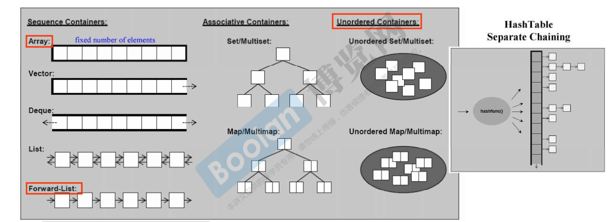

# 容器
## 结构分类
- 顺序容器
- 关联容器（associative - container）
- 无序容器



### 顺序容器

C++中有六种顺序容器：`std::vector`、`std::deque`、`std::list`、`std::forward_list`、`std::array`和`std::string`。

1. `std::vector`是一种可变大小的动态数组，支持快速随机访问。`std::vector`在内存中以连续的方式存储元素，并且支持常数时间复杂度的随机访问。`std::vector`的大小可以动态增长或缩小，但在中间插入或删除元素会导致后续元素的位置移动，因此效率较低。
2. `std::deque`是一种双端队列，支持在队列的前端和后端进行快速插入和删除操作。`std::deque`也在内存中以连续的方式存储元素，但是它的内部实现是以分段连续空间的形式存储，因此支持在两端进行快速的插入和删除操作。
3. `std::list`是一种双向链表，支持在任意位置进行插入和删除操作。`std::list`的内部实现是以双向链表的形式存储元素，因此插入和删除操作效率很高，但是随机访问元素的效率较低。
4. `std::forward_list`是一种单向链表，支持在链表的前端进行快速插入和删除操作，但不支持在链表的中间或后端进行快速访问或删除操作。`std::forward_list`的内部实现是以单向链表的形式存储元素。
5. `std::array`是一种固定大小的数组，支持快速随机访问。`std::array`在内存中以连续的方式存储元素，但其大小在编译时就已确定，因此不能动态增长或缩小。
6. `std::string`是一种特殊的顺序容器，它存储字符串。`std::string`也支持快速随机访问，但它的接口和语义与其他容器略有不同。

总的来说，顺序容器适用于需要顺序存储元素的场景。`std::vector`和`std::array`适用于需要随机访问元素的场景，而`std::deque`和`std::list`适用于需要在容器的前端或后端进行快速插入和删除操作的场景，`std::forward_list`适用于需要在前端进行快速插入和删除操作的场景。`std::string`则适用于存储字符串的场景。

### 关联容器

C++中有三种关联容器：`std::map`、`std::set` 和 `std::multimap`/`std::multiset`。

1. `std::map`是一种关联容器，它存储一对值，即关键字和与之相关联的值。`std::map`以关键字为索引，可以通过关键字快速访问相关的值，类似于字典。`std::map`内部实现是使用红黑树，因此它的元素是按照键的值自动排序的。`std::map`中的元素都是唯一的，如果插入重复的关键字，会覆盖旧值。
2. `std::set`是一种关联容器，它存储一组唯一的、已排序的元素，类似于数学中的集合。`std::set`也是以元素的值为索引，可以快速查找元素。`std::set`内部实现也是使用红黑树，因此它的元素是按照值自动排序的。如果插入重复的元素，`std::set`会忽略后续的插入操作。
3. `std::multimap`和`std::multiset`也是关联容器，它们与`std::map`和`std::set`的区别在于，它们允许存储重复的元素。`std::multimap`和`std::multiset`内部实现也是使用红黑树，但它们可以存储相同的键或值。如果插入重复的键或值，`std::multimap`和`std::multiset`会将它们插入到容器中。

总的来说，关联容器适用于需要快速查找元素的场景。`std::map`和`std::multimap`适用于需要根据关键字查找元素的场景，而`std::set`和`std::multiset`适用于需要快速查找元素并且不需要重复元素的场景。

### 无序容器

C++中有四种无序容器：`std::unordered_set`、`std::unordered_map`、`std::unordered_multiset`和`std::unordered_multimap`。

这些容器在内部使用<font color='red'>哈希表（hash table）</font>来存储元素，因此支持常数时间（平均情况下）的查找、插入和删除操作。

1. `std::unordered_set`是一个集合容器，存储一组不重复的元素。`std::unordered_set`中的元素不按照任何顺序存储，并且不能通过下标访问元素。
2. `std::unordered_map`是一个关联容器，存储一组键值对。`std::unordered_map`中的元素不按照任何顺序存储，并且可以通过键来访问元素。对于每个键，`std::unordered_map`中最多只能有一个对应的值。
3. `std::unordered_multiset`是一个集合容器，存储一组元素，可以有重复元素。`std::unordered_multiset`中的元素不按照任何顺序存储，并且不能通过下标访问元素。
4. `std::unordered_multimap`是一个关联容器，存储一组键值对，可以有重复键和值。`std::unordered_multimap`中的元素不按照任何顺序存储，并且可以通过键来访问元素。对于每个键，`std::unordered_multimap`中可以有多个对应的值。

<u>需要注意的是，由于哈希表是基于哈希函数来实现的，因此无序容器中的元素并不保证按照任何特定的顺序存储。此外，哈希表的实现可能会导致性能下降，例如在哈希冲突（hash collision）较多的情况下，哈希表的性能会下降。</u>

## 容器遍历

C++11提供了两种遍历容器的方法：

1. `for-range` 循环：使用`for`语句和范围表达式来遍历容器中的元素。`for-range` 循环可以用于遍历任何支持迭代器的容器，例如`std::vector`、`std::list`、`std::set`、`std::map`等。

```c++
std::vector<int> v = { 1, 2, 3 };
for (int i : v) {
    std::cout << i << '\n';
}
```

1. `std::for_each`：使用`std::for_each`算法和lambda表达式来遍历容器中的元素。`std::for_each`算法接受两个参数：要遍历的容器或迭代器范围，以及一个接受元素的lambda表达式。该算法对每个元素调用lambda表达式，并忽略返回值。

```c++
std::vector<int> v = { 1, 2, 3 };
std::for_each(v.begin(), v.end(), [](int i) {
    std::cout << i << '\n';
});
```

需要注意的是，以上两种方法都适用于任何支持迭代器的容器，但它们的性能和实现方式可能有所不同，应根据具体情况选择合适的方法。另外，C++11引入的这些方法与之前的遍历方式相比，具有更简洁、清晰和安全的语法，可以减少代码的编写量和错误的发生概率。


